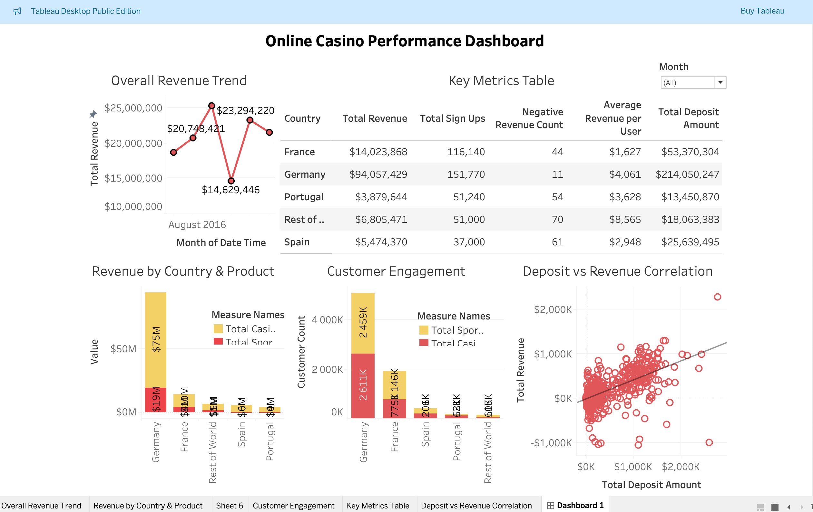

# iGaming Analytics Dashboard (Sportsbook & Casino Performance)

This project analyzes iGaming platform data across multiple countries to understand customer behavior, revenue performance, and trends across Sportsbook and Casino segments over time.

## 🎯 Objective
- Analyze revenue performance across different countries  
- Compare Sportsbook vs Casino contribution  
- Understand customer activity and conversion (sign-ups → active users)  
- Evaluate the relationship between deposits and revenue  

## 🛠 Tools Used
- Excel (Data Cleaning)
- Tableau (Dashboard)
- PowerPoint (Presentation)

## 📊 Key Insights
- Revenue varies significantly across countries, highlighting regional performance differences  
- Casino and Sportsbook contribute differently depending on the market  
- Higher deposits generally correlate with higher revenue, but not consistently across all regions  
- Customer activity does not always translate directly into revenue generation  
- Some regions show lower performance despite user growth, indicating potential inefficiencies  

## 📁 Files Included
- Raw and cleaned dataset (country + time-based data)
- Tableau dashboard (.twbx)
- Presentation slides

## 📷 Dashboard Preview

